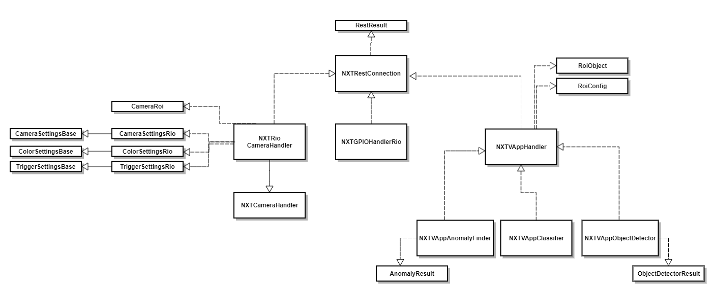
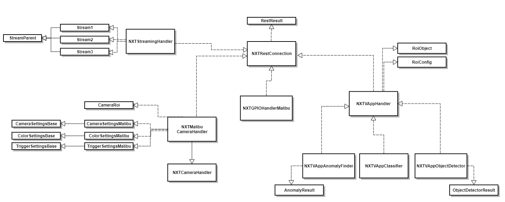

# Python API for NXT
This API provides functions to interact with IDS NXT cameras as well as with Vision Apps.

In some cases there is a difference between the IDS NXT rio (or rome) and the IDS NXT malibu
functionalities. A structural overview is provided in the Usage/ProjectStructure section.

## Getting Started
### Prerequisites
- Python 3.12


### Install
````
git clone https://github.com/NinaStegmayer/nxt-python-api.git
````
````
python -m venv myvenv (or python3 -m venv myvenv depending on system)
source myvenv/bin/activate

````

## Usage
### Project Structure
For IDS NXT rio: 


For IDS NXT malibu:


### Examples 
Use cases can be found in the `nxt-python-api/examples` directory

The `/examples/{class}_examples.py` are more detailed (than the config examples) 
but not necessarily executable in order.

### Configuration 
Parameters for RestConnection can be specified in the `nxt-python-api/config/config.ini` directory
````
[DEFAULT]
IP = your.IP.address
USER = your_user_name
PASSWORD = your_password
````

Instead of passing the parameters establish the connection with the following code: 
````
config = NXTConfig()
rest_connection = NXTRestConnection(config.ip, config.user, config.password)
````

### Logging
For Logging the following import is required: 
`from logs.logger import nxt_logger`

This enables the use of the nxt_logger functionalities such as 
````
nxt_logger.debug("...")
nxt_logger.info("...")
nxt_logger.warn("...")
nxt_logger.error("...")
````

### Roadmap Vision Apps
1. Establish `NXTRestConnection` with `IP`, `username`, `password`
````
rest_connection = NxtRestConnection({IP}, {username}, {password})
````
2. Initialize required VisionApp (`NXTVAppAnomalyFinder.py`, `NXTVAppClassifier.py`) and hand over your `NXTRestConnection`
````
{your_vision_app} = NXTVAPP{AppName}(rest_connection)
````
3. Install and activate your VisionApp by calling 
````
{your_vision_app}.vapphandler.setup_vapp({VAPP_PATH}, {VAPP_NAME})
````
4. Install and specify required CNN: 
````
if CNN_FILE_NAME not in {your_vision_app}.get_available_cnns():
        {your_vision_app}.install_cnn(CNN_PATH)

    {your_vision_app}.set_current_cnn(CNN_FILE_NAME)
````

5. Work with the functionalities of the Vision App
````
{your_vision_app}.{func}
````


### Roadmap Camera communication
1. Establish `NXTRestConnection` with `IP`, `username`, `password`
````
rest_connection = NXTRestConnection({IP}, {username}, {password})
````
2. Initialize `NXTCameraHandlerRio` or `NXTCameraHandlerMalibu` - depending on the used camera type -
and hand over your `NXRestConnection.py`
````
camera_handler = NxtCameraHandlerRio(rest_connection)
or
camera_handler = NxtCameraHandlerMalibu(rest_connection)
````
3. Get current or configure required settings, trigger image acquisition, get latest images by calling functions on `camera_handler` 


### Roadmap GPIO communication
1. Establish `NXTRestConnection.py` with `IP`, `username`, `password`
````
rest_connection = NXTRestConnection({IP}, {username}, {password})
````
2. Initialize `NXTGPIOHandlerRio` or `NXTGPIOHandlerMalibu` - depending on the used camera type -and hand over your `NXTRestConnection.py`
````
gpio_handler = NxtGPIOHandlerRio(rest_connection)
or
gpio_handler = NxtGPIOHandlerMalibu(rest_connection)
````

3. Set or get pins (How to is described in: `nxt-python-api/examples/GPIOexample.py` )


### Exemplary configuration of the AnomalyFinder Vision App
````nxt-python-api/examples/anomaly_finder_config_example.py````

````
from config.nxt_config import NXTConfig
from nxt_rest_connection import NxtRestConnection
from vapps.nxt_vapp_anomaly_finder import NXTVAppAnomalyFinder
from logs.logger import nxt_logger

if __name__ == "__main__":

    config = NXTConfig()

    CNN_PATH = r"{absolute path from your directory to required CNN}"
    """requires absolute path to the CNN with file ending 
        .rano for IDS NXT rio Cameras / .mano for IDS NXT malibu Cameras"""
    CNN_NAME = 'AnoBackUp_v4_0_400'
    VAPP_PATH = r"{path from your directory to anomaly finder vision app}"
    """requires absolute path of the Vision App with file ending .vapp"""

    rest_connection = NXTRestConnection(config.ip, config.user, config.password)
    anomaly_finder_app = NXTVAppAnomalyFinder(rest_connection)

    anomaly_finder_app.vapp_handler.setup_vapp(VAPP_PATH, anomaly_finder_app.vapp)

    if CNN_NAME not in anomaly_finder_app.get_available_cnns():
        anomaly_finder_app.install_cnn(CNN_PATH)

    anomaly_finder_app.set_current_cnn(CNN_NAME)

    anomaly_finder_app.set_threshold(70)

    anomaly_finder_app.show_anomaly_map(True)
    anomaly_finder_app.show_anomaly_overlay(True)
    nxt_logger.info(anomaly_finder_app.get_last_anomaly_result())

    anomaly_finder_app.save_anomaly_map('./anomalyImage.jpg')
    anomaly_finder_app.save_result_image('./resultImage.jpg')
   ````


